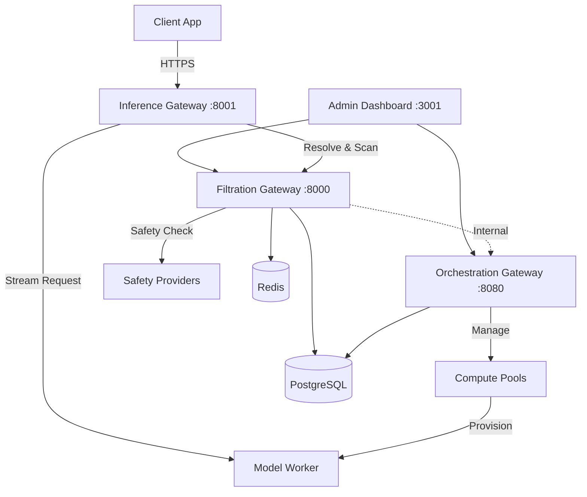

InferiaLLM uses a microservices architecture split into two planes:

* **Data Plane** – Handles inference traffic (North-South via REST/HTTP)
* **Control Plane** – Manages execution policy and routing (East-West via gRPC)

## High-Level Diagram

## Component Details

### Inference Gateway (Port 8001)

The **Inference Gateway** is a stateless, high-performance proxy that implements the OpenAI API specification.

**Responsibilities:**
- Request validation and normalization
- Context resolution via Filtration Gateway
- Rate limiting and quota checks
- Input/output guardrail enforcement
- Prompt processing (RAG, templates)
- Upstream LLM routing and streaming

**Endpoint:** `POST /v1/chat/completions`

**Request Flow:**
1. Auth → Context Resolution → Rate Limiting → Quota Check
2. Input Guardrails → Prompt Processing (RAG/Templates)
3. Upstream LLM Call → Output Guardrails → Logging

### Filtration Gateway (Port 8000)

The **Filtration Gateway** is the security and policy enforcement layer.

**Responsibilities:**
- Authentication (JWT + TOTP 2FA)
- Role-Based Access Control (RBAC)
- Guardrail scanning (PII, toxicity, prompt injection)
- Quota and rate limit enforcement
- Audit logging
- Provider configuration management

**Key Endpoints:**
| Path | Description |
| --- | --- |
| `/auth/*` | Authentication (login, register, 2FA) |
| `/management/*` | Deployments, API keys, configs |
| `/internal/*` | Service-to-service APIs |
| `/admin/*` | RBAC management |
| `/audit/*` | Audit logs |

### Orchestration Gateway (Port 8080 HTTP, 50051 gRPC)

The **Orchestration Gateway** manages compute infrastructure and model deployments.

**Responsibilities:**
- Compute pool management
- Model deployment lifecycle
- Inventory tracking and heartbeats
- Multi-provider abstraction (K8s, SkyPilot, Nosana, Akash)

**Key Endpoints:**
| Path | Description |
| --- | --- |
| `/deployment/deploy` | Create deployment |
| `/deployment/deployments` | List deployments |
| `/deployment/listPools/{owner_id}` | List compute pools |
| `/inventory/heartbeat` | Node health reporting |

**gRPC Services:**
- `ComputePoolManagerService` - Pool CRUD
- `ModelRegistryService` - Model registry
- `ModelDeploymentService` - Deployment operations

### Admin Dashboard (Port 3001)

React-based admin interface for managing the entire platform.

**Features:**
- Deployment management with logs viewer
- Compute pool and instance management
- API key management
- Knowledge base (RAG) management
- User and role management
- Provider configuration
- Audit log viewer

## Data Flow

1. **Client Request**: `POST /v1/chat/completions` to Inference Gateway
2. **Context Resolution**: IG queries Filtration Gateway with API key
3. **Policy Checks**: Rate limits, quotas, input guardrails
4. **Prompt Processing**: Apply templates, retrieve RAG context
5. **Upstream Call**: Route to provider (vLLM, OpenAI, Nosana worker)
6. **Response Streaming**: Stream tokens back to client
7. **Logging**: Async log to Filtration Gateway

## Compute Provider Abstraction

The Orchestration Gateway uses an **Adapter Pattern** to abstract infrastructure:

| Adapter | Provider Type | Description |
| --- | --- | --- |
| `kubernetes` | On-Prem/Cloud | Standard K8s GPU clusters |
| `skypilot` | Multi-Cloud | AWS, GCP, Azure VMs |
| `nosana` | DePIN | Decentralized GPU network (Solana) |
| `akash` | DePIN | Decentralized compute marketplace |

## Database Schema

**PostgreSQL** stores:
- Organizations, Users, Roles
- API Keys, Deployments
- Policies, Usage quotas
- Inference logs, Audit logs
- Compute pools, Inventory

**Redis** provides:
- Rate limiting counters
- Hot state caching
- Task queue (Redis Streams)
