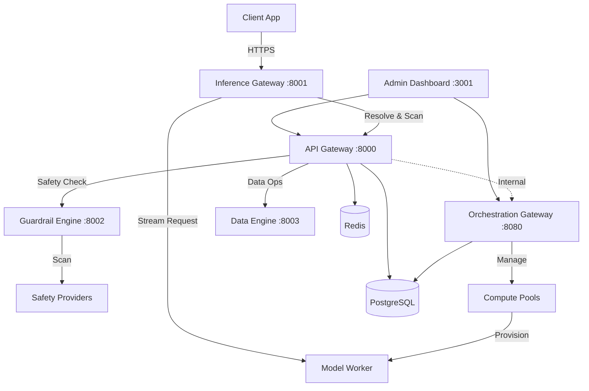

InferiaLLM uses a microservices architecture split into two planes:

* **Data Plane** – Handles inference traffic (North-South via REST/HTTP)
* **Control Plane** – Manages execution policy and routing (East-West via gRPC)

## High-Level Diagram

```mermaid
graph TD
    Client[Client App] -->|HTTPS| IG[Inference Gateway :8001]
    Dashboard[Admin Dashboard :3001] --> AG
    Dashboard --> OG

    IG -->|Resolve & Scan| AG[API Gateway :8000]
    AG -.->|Internal| OG[Orchestration Gateway :8080]
    AG -->|Safety Check| GE[Guardrail Engine :8002]
    IG -->|Stream Request| Worker[Model Worker]

    GE -->|Scan| Providers[Safety Providers]
    OG -->|Manage| Pool[Compute Pools]
    Pool -->|Provision| Worker
    AG -->|Data Ops| DE[Data Engine :8003]

    AG --> DB[(PostgreSQL)]
    AG --> Redis[(Redis)]
    OG --> DB
```

## Component Details

### Inference Gateway (Port 8001)

The **Inference Gateway** is a stateless, high-performance proxy that implements the OpenAI API specification.

**Responsibilities:**
- Request validation and normalization
- Context resolution via API Gateway
- Rate limiting and quota checks
- Input/output guardrail enforcement via Guardrail Engine
- Prompt processing (RAG, templates)
- Upstream LLM routing and streaming

**Endpoint:** `POST /v1/chat/completions`

**Request Flow:**
1. Auth → Context Resolution → Rate Limiting → Quota Check
2. Input Guardrails → Prompt Processing (RAG/Templates)
3. Upstream LLM Call → Output Guardrails → Logging

### API Gateway (Port 8000)

The **API Gateway** is the security and policy enforcement layer.

**Responsibilities:**
- Authentication (JWT + TOTP 2FA)
- Role-Based Access Control (RBAC)
- Quota and rate limit enforcement
- Audit logging
- Provider configuration management

### Guardrail Engine (Port 8002)

The **Guardrail Engine** handles content safety scanning as a dedicated service.

**Responsibilities:**
- PII detection and redaction
- Toxicity filtering
- Prompt injection detection
- Secret detection
- Multiple safety providers (LLM Guard, Llama Guard, Lakera)

### Data Engine (Port 8003)

The **Data Engine** handles knowledge base and data processing operations.

**Responsibilities:**
- Knowledge base management and vector operations
- Document ingestion and processing
- Data transformation and enrichment
- Integration with ChromaDB for vector storage

**Key Endpoints:**
| Path | Description |
| --- | --- |
| `/auth/*` | Authentication (login, invitations, 2FA) |
| `/management/*` | Organizations, deployments, API keys, configs, users |
| `/management/admin/*` | RBAC roles and user management |
| `/internal/*` | Service-to-service APIs |
| `/audit/*` | Audit logs with category filtering |
| `/api/v1/*` | Proxy routes to Orchestration Gateway |

### Orchestration Gateway (Port 8080 HTTP, 50051 gRPC)

The **Orchestration Gateway** manages compute infrastructure and model deployments.

**Responsibilities:**
- Compute pool management
- Model deployment lifecycle
- Inventory tracking and heartbeats
- Multi-provider abstraction (K8s, SkyPilot, Nosana, Akash)

**Key Endpoints:**
| Path | Description |
| --- | --- |
| `/deployment/deploy` | Create deployment |
| `/deployment/deployments` | List deployments |
| `/deployment/listPools/{owner_id}` | List compute pools |
| `/inventory/heartbeat` | Node health reporting |

**gRPC Services:**
- `ComputePoolManagerService` - Pool CRUD
- `ModelRegistryService` - Model registry
- `ModelDeploymentService` - Deployment operations

### Admin Dashboard (Port 3001)

React-based admin interface for managing the entire platform.

**Features:**
- Deployment management with preflight validation (VRAM, format, compatibility checks)
- Compute pool management across Nosana, AWS, GCP, Akash, and Kubernetes
- API key management with per-deployment scoping
- Knowledge base (RAG) and prompt template configuration per deployment
- User, role, and invitation management
- Multi-credential management for compute providers
- Audit log viewer with category filtering and actor identification
- Real-time terminal logs for running deployments via WebSocket

## Data Flow

1. **Client Request**: `POST /v1/chat/completions` to Inference Gateway
2. **Context Resolution**: IG queries API Gateway with API key
3. **Policy Checks**: Rate limits, quotas via API Gateway
4. **Safety Scan**: Input guardrails via Guardrail Engine
5. **Prompt Processing**: Apply templates, retrieve RAG context via Data Engine
6. **Upstream Call**: Route to provider (vLLM, Ollama, OpenAI, Nosana worker)
7. **Response Streaming**: Stream tokens back to client
8. **Output Scan**: Output guardrails via Guardrail Engine
9. **Logging**: Async log to API Gateway

## Compute Provider Abstraction

The Orchestration Gateway uses an **Adapter Pattern** to abstract infrastructure:

| Adapter | Provider Type | Description |
| --- | --- | --- |
| `kubernetes` | On-Prem/Cloud | Standard K8s GPU clusters |
| `skypilot` | Multi-Cloud | AWS, GCP, Azure VMs |
| `nosana` | DePIN | Decentralized GPU network (Solana) |
| `akash` | DePIN | Decentralized compute marketplace |

## Database Schema

**PostgreSQL** stores:
- Organizations, Users, Roles, Invitations
- API Keys, Deployments, Policies
- Usage stats, Quotas, Billing events
- Inference logs, Audit logs (with categories: auth, security, deployment, api_key, organization, credential, configuration, knowledge_base)
- Compute pools, Inventory, Workload assignments
- Provider credentials (encrypted), Provider resources
- Model registry, System settings

**Redis** provides:
- Rate limiting counters
- Hot state caching (context cache with configurable TTL)
- Task queue (Redis Streams & Pub/Sub)
