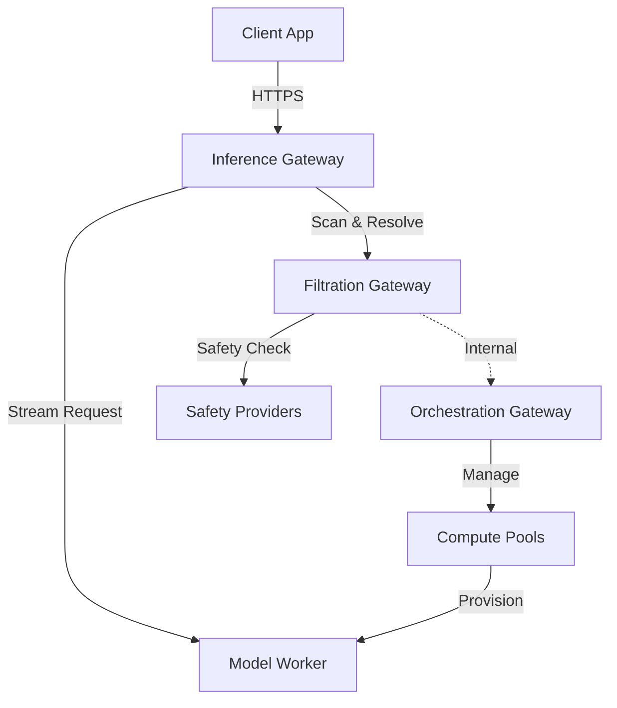

Inferia LLM utilizes a microservices architecture to decouple inference serving from orchestration and security. This design allows for independent scaling and robust failure isolation.

## High-Level Diagram

## Component Details

### Inference Gateway
The **Inference Gateway** is a stateless proxy that implements the OpenAI API specification.
- **Responsibilities**: Request validation, response streaming.
- **Optimization**: Uses **Redis Context Caching** (TTL 60s) to minimize network calls for routing configuration.
- **Scaling**: Horizontally scalable behind a load balancer.

### Filtration Gateway
The **Filtration Gateway** acts as a centralized security and policy checkpoint.
- **Responsibilities**: 
    - **Context Resolution**: Resolves routing and config for the Inference Gateway (cached).
    - **Parallel Guardrails**: Executes PII redaction and Input Scanning concurrently.
    - **Quota Management**: High-speed **Redis-based** quota enforcement.
    - **Audit Logging**: Asynchronous logging of all interactions.
- **Providers**: Integrates with external providers like Llama Guard, Lakera, and local PII models.

### Orchestration Gateway
The **Orchestration Gateway** manages the physical and logical infrastructure. It exposes both a **REST API** (Deployment Management) and a **gRPC Interface** (Internal Service Communication).
- **Responsibilities**:
    - **Inventory Management**: Tracking active nodes and their health.
    - **Job Dispatch**: Using the Adapter Pattern to provision resources on Kubernetes, SkyPilot, or Nosana.
    - **Model Registry**: Storing configuration for supported models.

## Data Flow

1. **Auth**: Client authenticates with `Inference Gateway`.
2. **Resolve**: IG checks local cache or queries `Filtration Gateway` for context/routing.
3. **Scan**: Request payload is sent to `Filtration Gateway` for parallel safety scanning.
4. **Execute**: Validated request is forwarded to the worker (e.g., vLLM container).
5. **Stream**: Tokens are streamed back to the client.
6. **Log**: Inference metadata is asynchronously logged to `Filtration Gateway` (fire-and-forget).

